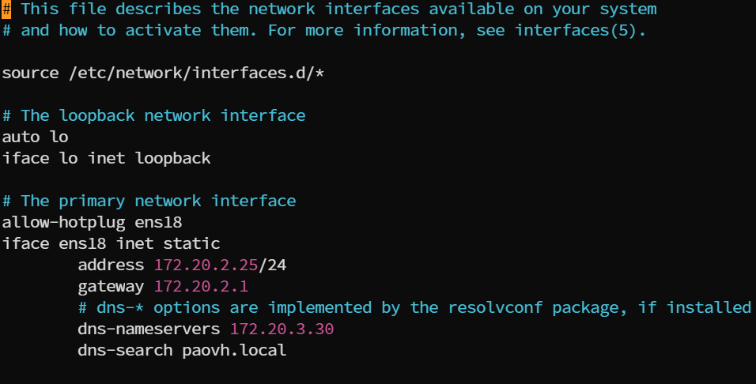
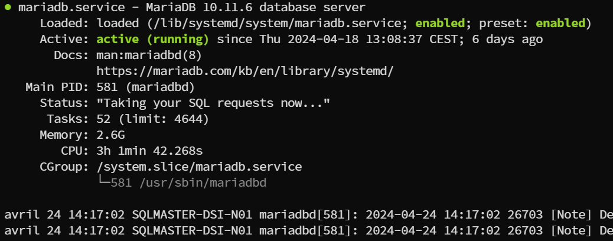
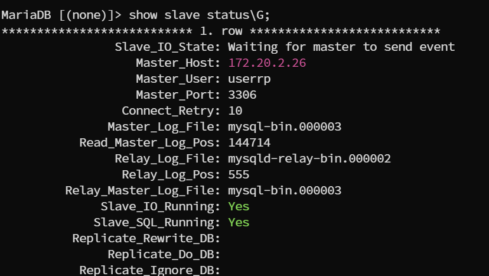
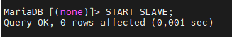
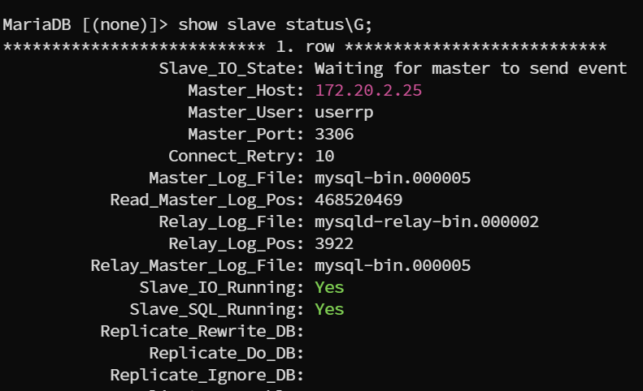
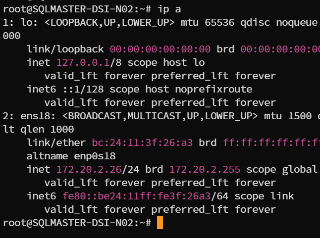
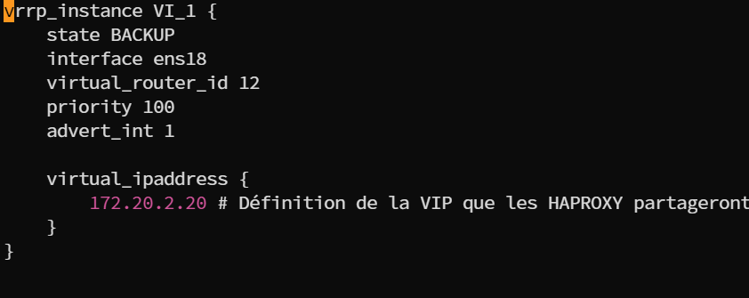
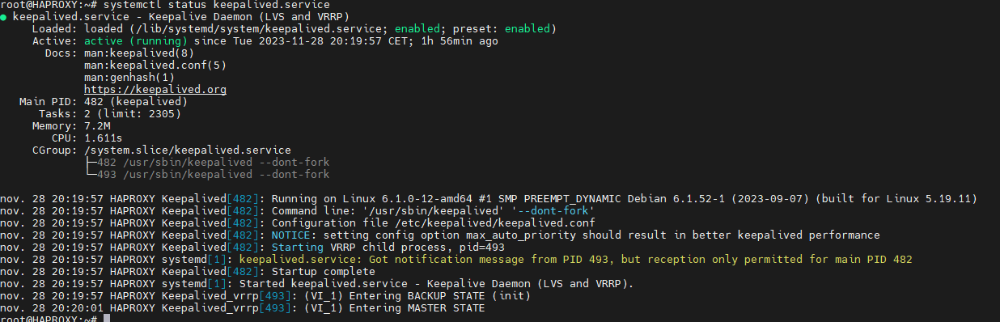
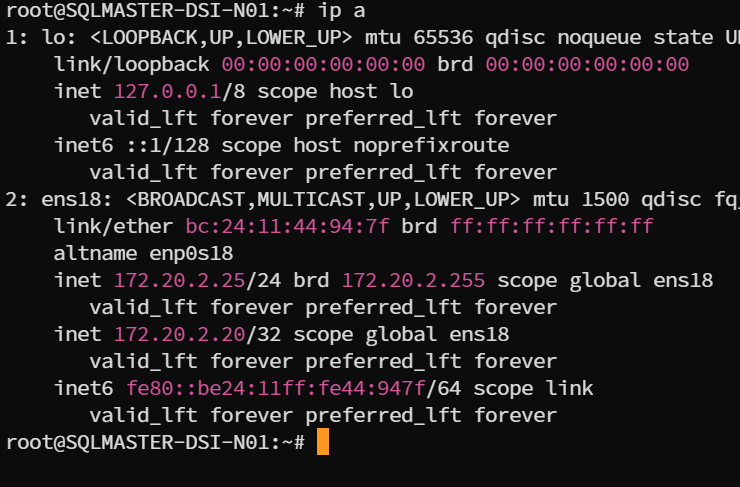
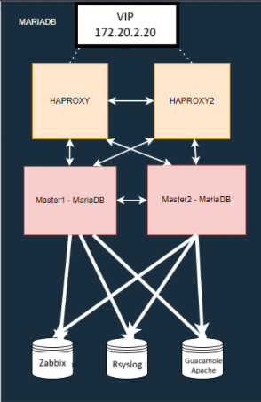

# Configuration de Réplication et de Répartition de Charges avec MariaDB, HAProxy et Keepalived  

## 1. Configuration Master-Master avec MariaDB/MySQL

Prérequis :
- Proxmox
- Héberger sur debian
- MariaDB
- MySQL

## Mise en place debian sur ProxMox

### Création de la machine virtuelle dans ProxMox

importez l'iso debian dans votre pool de stockage, ensuite creez votre machine virtuelle avec l'iso précédemment ajouter, choisissez le stockage, la ram, le cpu, pour le résaux cela dépend de votre configuration.

Répétez l'opération pour la deuxième vm

### Configuration de debian

Une fois la machine virtuelle démarré faites l'installation de debian, choisissez votre langue, votre pays, votre clavier, votre nom de machine, votre nom d'utilisateur et votre mot de passe. Pour les packages choisissez juste SSH server, standard system utilities et apache2.
Une fois l'installation terminé, connectez vous en SSH avec votre utilisateur et votre mot de passe.


### Mettre en place les configurations réseaux sur les machines virtuelles

Sur les deux vms faites : 

```bash
sudo nano /etc/network/interfaces
```
Puis renseigner la configuration réseau comme ceci, attention à bien mettre une IP différente sur chaque vms :



### Installer MariaDB
```bash
sudo apt update
sudo apt install mariadb-server
systemctl start mariadb.socket
systemctl status mariadb
```
Vous devriez le voir actif comme ceci : 



A faire sur les deux vms :

### Définition d'un utilisateur de réplication pour les deux vms

Faites cette commande sur la VM Master1 pour vous connectez à MariaDB :
```bash
mysql -u votre_utilisateur -p
```

```sql
CREATE USER 'userrp'@'%' IDENTIFIED BY 'userrp';
GRANT REPLICATION SLAVE ON *.* TO 'userrp'@'%';
```
Et faite de même pour la Master2 avec le même user

### Modifiez le fichier de configuration de MariaDB/MySQL sur le premier serveur (Master 1)

1. 
```bash
sudo nano /etc/mysql/my.cnf
```
2. Master 1
```ini
[mariadb]
server-id = 1
log_bin = /var/log/mysql/mysql-bin.log
binlog_do_db = nom_de_la_base_de_donnees

[mysqld]
bind-address = 0.0.0.0

```
Master-Master = faire écouter les deux sur 0.0.0.0 (pour un master-slave faire ecouter le master sur 0.0.0.0 et pas le slave, dans ce cas si il faut faire écouter les deux sur 0.0.0.0 pour qu'elle soit Master l'une envers l'autre)

3. 

```bash
sudo systemctl restart mariadb
```

### Modifiez le fichier de configuration de MariaDB/MySQL sur le premier serveur (Master 2)

1. 
```bash
sudo nano /etc/mysql/my.cnf
```
2. Master 2
```ini
[mariadb]
server-id = 2 => Ligne à changer
log_bin = /var/log/mysql/mysql-bin.log
binlog_do_db = nom_de_la_base_de_donnees

[mysqld]
bind-address = 0.0.0.0

```
3. 

```bash
sudo systemctl restart mariadb
```


### Configuration de la Réplication Master1
1. Connectez vous à la bdd

```bash
mysql -u votre_utilisateur -p
```
2. Afficher l'etat du Master1

```sql
SHOW MASTER STATUS;
```
Résultat : 



Pensez à bien noter le résultat "**File** et **Position**"

3. Paramétré la réplication sur les deux Master en mettant la configuration des Masters obtenu avec la commande "SHOW MASTER STATUS;". Configuration croisé.

Master1 :

```sql
CHANGE MASTER TO
  MASTER_HOST='IP_M2',
  MASTER_USER='userrp',
  MASTER_PASSWORD='userrp',
  MASTER_PORT=3306,
  MASTER_LOG_FILE='File',
  MASTER_LOG_POS='Position',
  MASTER_CONNECT_RETRY=10;

```
Master 2: 

```sql
CHANGE MASTER TO
  MASTER_HOST='IP_M1',
  MASTER_USER='userrp',
  MASTER_PASSWORD='userrp',
  MASTER_PORT=3306,
  MASTER_LOG_FILE='File',
  MASTER_LOG_POS='Position',
  MASTER_CONNECT_RETRY=10;

```


4. Commencer la réplication

```sql
START SLAVE;
```


5. Afficher l'état de la réplication

```sql
SHOW SLAVE STATUS\G
```


```bash
ip a
```


On peut voir que je suis sur la vm 172.20.2.26 et que mon Master à pour IP 172.20.2.25 et inversement sur l'autre vm donc la réplication ce fait bien. 
Le plus important c'est de constater le "yes" à la ligne "Slave_SQL_Running:"

## 2. Configuration de deux HaProxy qui gèreront la répartion de charges

Prérequis :
- Proxmox
- Héberger sur debian
- HaProxy
- KeepAlived

[Mettre en place les Machines Virtuelles](#mise-en-place-debian-sur-proxmox)

[Mettez en place une configuration réseau sur les deux VM HaProxy comme au début de la doc](#mettre-en-place-les-configurations-réseaux-sur-les-machines-virtuelles)

### Installation de HaProxy 
1. Installation de HAProxy sur les deux serveurs :

```bash
sudo apt update
sudo apt install haproxy
```
2. Configuration de HAProxy sur les deux serveurs :
Modifiez le fichier de configuration de HAProxy (/etc/haproxy/haproxy.cfg) sur les deux serveurs pour configurer le répartiteur de charge. Utilisez la configuration suivante en ajustant selon vos besoins :

```bash
sudo nano /etc/haproxy/haproxy.cfg
```
```ini
frontend db #Requête entrante BDD
   mode tcp #Requête Tcp
   bind 0.0.0.0:3306 #Port BDD
   default_backend db

backend db
   mode tcp  #Requête Tcp
   balance roundrobin #Répartition de charges

   # Enable MySQL health checks
   option mysql-check user haproxy 

   server s1 172.20.2.25:3306 check
   server s2 172.20.2.26:3306 check

```

```bash
sudo systemctl start haproxy
sudo systemctl status haproxy
```

Répéter les mêmes opérations sur l'autre VM HAPROXY2

## 3. Configuration de KeepAlived sur les HAPROXY afin de mettre en place une VIP

1. Installation de KeepAlived

```bash
sudo apt update
sudo apt install keepalived
```
2. Modifiez le fichier de configuration de Keepalived (/etc/keepalived/keepalived.conf) sur les deux serveurs en utilisant les mêmes variables :

```ini
vrrp_instance VI_1 {
    state BACKUP
    interface ens18
    virtual_router_id 12
    priority 100
    advert_int 1
}
virtual_ipaddress {
    172.20.2.20 #Définition de la VIP que les HAPROXY partageront
}
```
Résultat :



3. Vérification du service KeepAlived et du partage de VIP 

```bash
sudo systemctl status keepalived
```


On remarque que le service Keepalived est bien actif

```bash
ip a
```


On remarque qu'il y a bien la VIP 172.20.2.20 de renseigner lorsqu'on fait un "ip a"

Il faudra évidemment répéter ses opération sur les deux VM Haproxy.

### Shéma infra de Réplication et de Répartition de Charges avec MariaDB, HAProxy et Keepalived 


