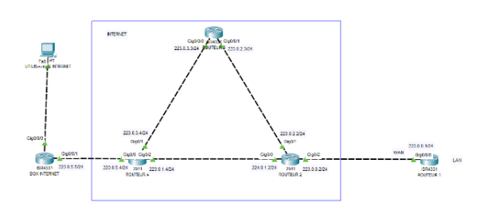

# Configurer EIGRP
Le but de ce tp est de relier les utilisateurs d'Internet entre eux. Dans cette configuration, le data center et l’utilisateur utilisant une BOX seront placés au même niveau.
Vous allez donc placer un PC pour le simple utilisateur d'Internet, le relier à un routeur (une BOX) puis ajouter entre le routeur 1 et la BOX quelques routeurs comme ceci :

Commencez par les trois routeurs au centre du réseau (routeurs 2, 3 et 4) :
```bash
Routeur2(config)#router eigrp 1
```
Avec ces commandes, vous créez un AS (système autonome), que vous pouvez voir comme un groupe, et lui attribuez le numéro 1. Seuls les routeurs ayant été configurés avec cet AS seront associés comme voisins.
De base, l’agrégation d'adresse est déjà configurée sur les appareils CISCO. Vous allez la désactiver, car ces adresses peuvent se simplifier :
```bash
Routeur2(config-router)#no auto-summary
Routeur2(config-router)#network [IP] [WILDCARD]
Routeur2(config-router)#network [IP1] [WILDCARD1]
Routeur2(config-router)#network [IP2] [WILDCARD2]
```


Info : 

 Vous ne savez pas ce qu’est l’agrégation d’adresse ? C’est un principe assez simple à comprendre. Pour réduire le nombre d’entrées dans sa table de routage, EIGRP va simplifier les réseaux, lorsque cela est possible. Il va prendre deux sous-réseaux, ou plus, et les mélanger pour ne faire qu’un seul réseau plus important. Ainsi avec les réseaux : 223.0.1.0/24, 223.0.2.0/24, il pourrait ne créer qu’un seul réseau 223.0.1.0/23. Cela peut être utile dans certains cas, mais dans le nôtre, il existe bel et bien un réseau 223.0.0.0/24 et il ne doit pas être confondu avec un autre.
Ici, vous ajoutez les réseaux correspondants à vos interfaces. 


EIGRP tentera de se connecter à tous les voisins sur ces réseaux et transmettra les informations de vos réseaux à vos voisins.

Faites la même chose pour les routeurs 3 et 4 :

Routeur 3 : 
```bash
Routeur3(config)#router eigrp 1
Routeur3(config-router)#no auto-summary
Routeur3(config-router)#network [IP2] [WILDCARD2]
Routeur3(config-router)#network [IP3] [WILDCARD3]
```
Routeur 4 :
```bash
Routeur4(config)#router eigrp 1
Routeur4(config-router)#no auto-summary
Routeur4(config-router)#network [IP1] [WILDCARD1]
Routeur4(config-router)#network [IP3] [WILDCARD3]
Routeur4(config-router)#network [IP4] [WILDCARD4]
```
Comme vous le voyez, nous avons configuré EIGRP sur chaque interface connectée à des WAN. Pour le routeur 1 et la BOX composée aussi de LAN vous devrez faire la même opération, mais sans ajouter le LAN.


Connectez-vous donc au routeur 1 et entrez ces commandes :
```bash
Routeur1(config)#router eigrp 1
Routeur1(config-router)#no auto-summary
Routeur1(config-router)#network [IP] [WILDCARD]
```
Puis sur la BOX :
```bash
BOX(config)#router eigrp 1
BOX(config-router)#no auto-summary
BOX(config-router)#network [IP4] [WILDCARD4]
```
Pour vérifier la configuration d’EIGRP :
```bash
Routeur2#show ip protocols
Routeur2#show ip eigrp neighbors
Routeur2#show ip eigrp topology
Routeur2#show ip route
```
Il est possible aussi de redistribuer des routes static avec la commande « redistribute static »


