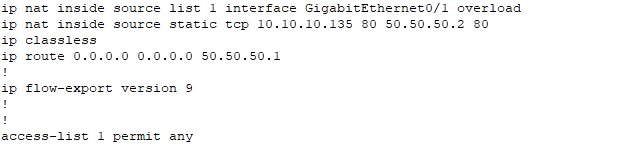

# NAT Cisco 

```bash
"ip nat outside" sur l'interface sortante du routeur
"ip nat inside" sur l'interface entrante du routeur
```

### ACL sur le routeur detenant le nat

Définir l'ACL :

```bash
acces-list 1 permit any
```
Evidemment l'acl est à redéfinir en fonction des besoin de sécurité.s

### Sur l'interface externe pour la translation d'ip : 

```bash
ip nat inside source list 1 interface gigabitEthernet 0/1 overload
```
### Redirection de port : 

```bash
ip nat inside source static [service] [ip source] [port] [ip public] [port]
```

Un exemple de la configuration venant de notre lab cisco : 

