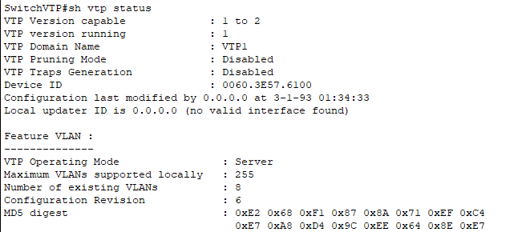
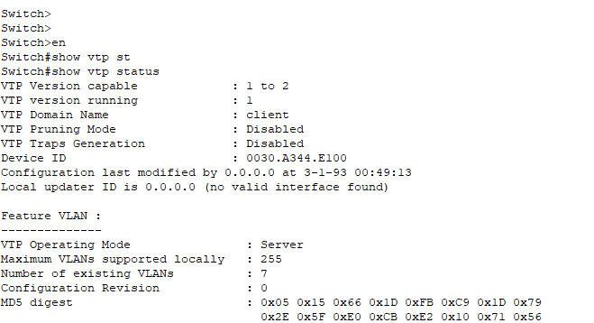

# Mettre un switch en mode serveur VTP

## 1. Accédez à la configuration du commutateur : 

Utilisez une connexion console, Telnet ou SSH pour accéder à l'interface en ligne de commande du switch.
Une fois en CLI sur le switch, accédez au mode de configuration en mode global :

```bash
enable
 configure terminal
```
## 2. Configurez le mode VTP en tant que serveur  

Utilisez la commande vtp mode server pour configurer le switch en tant que serveur VTP. Le mode serveur permet au switch de gérer les VLANs locaux et de diffuser les informations de VLAN aux autres commutateurs VTP.
```bash
- vtp version 1 ou 2 (nous sommes en 1 sur nos exemple)
- vtp mode server
```
## 3. Définissez le nom du domaine VTP  

Le nom du domaine VTP est un identifiant unique qui permet aux commutateurs de se synchroniser. Assurez-vous que le nom du domaine est le même pour tous les commutateurs que vous souhaitez inclure dans le même domaine VTP.

```bash
- vtp domain <NOM_DU_DOMAINE>
```
Remplacez <NOM_DU_DOMAINE> par le nom que vous souhaitez attribuer au domaine VTP.
 
 Définissez le mot de passe VTP (optionnel) : Vous pouvez sécuriser les mises à jour VTP avec un mot de passe si vous le souhaitez. 

Utilisez la commande vtp password pour définir un mot de passe VTP. Assurez-vous que le mot de passe est identique pour tous les commutateurs du domaine VTP.


```bash
-  vtp password <VOTRE_MOT_DE_PASSE>
```
Remplacez <VOTRE_MOT_DE_PASSE> par le mot de passe de votre choix.
## 5. Enregistrez la configuration :
Une fois que vous avez terminé de configurer le commutateur en tant que serveur VTP, assurez-vous d'enregistrer la configuration :
```bash
end
write memory
```
## 6. Vérifiez la configuration VTP : 

Vous pouvez utiliser la commande «show vtp status» pour vérifier la configuration et voir le statut du serveur VTP :



## 7. Mettre un switch en mode client VTP
Comme précédemment, une fois en CLI on accède au mode de configuration globale :

```bash

enable
configure terminal
- Vtp mode client
- Vtp domain « votrenomdedomaine »
```

On vérifie ensuite que le switch est bien configuré en mode client avec show vtp status encore une fois :




Il suffit ensuite d’ajouter les VLAN au switch qui fait office de serveur VTP, le switch en mode client récupèrera les VLAN ajoutée sur le switch serveur VTP si tout a bien été configuré.