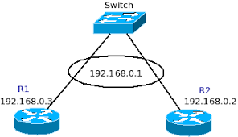

# Procédure HSRP

## Configuration de l'interface :
### Configurez HSRP sur les interfaces concernées avec un groupe HSRP identique sur les deux routeurs. L'adresse IP virtuelle doit être la même sur les deux routeurs.
```ini
Router1(config)# interface [type] [numéro]
Router1(config-if)# standby [groupe] ip [adresse virtuelle]
Router1(config-if)# standby [groupe] priority [valeur de priorité]
Router1(config-if)# standby [groupe] preempt

Router2(config)# interface [type] [numéro]
Router2(config-if)# standby [groupe] ip [adresse virtuelle]
Router2(config-if)# standby [groupe] priority [valeur de priorité]
Router2(config-if)# standby [groupe] preempt
    • [groupe] est le numéro du groupe HSRP (commun entre les deux routeurs).
    • [adresse virtuelle] est l'adresse IP virtuelle partagée entre les deux routeurs.
    • [valeur de priorité] est la priorité du routeur. Le routeur avec la priorité la plus élevée devient le routeur actif.
```

### Vérification de la configuration
```ini
Router1# show standby [interface]
```
Assurez-vous que les adresses IP virtuelles et les statuts HSRP sont corrects. Le routeur avec la priorité la plus élevée dans un groupe devient le routeur actif :


Et le routeur avec la priorité la moins élevée doit passer en routeur de standby (passif si routeur 1 actif) :


Notes : 
    
    - Vous pouvez ajuster les priorités en fonction de vos besoins, et utiliser la préemption pour permettre au routeur ayant la priorité la plus élevée de reprendre son rôle d'actif lorsqu'il redevient disponible.
    - Vérifiez la compatibilité des versions de HSRP entre les routeurs si vous travaillez avec des routeurs de modèles différents.

Un exemple avec ce shéma : 



Le routeur 1 et 2 partage la même VIP qui est 192.168.0.1

