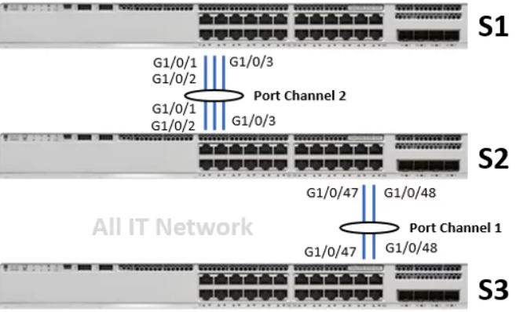

# LACP #

Le principe du LACP (Link Aggregation Control Protocol) est de permettre la création d'une liaison réseau à haut débit en agrégeant plusieurs liens physiques entre deux équipements réseau. Il facilite la répartition de la charge du trafic et offre une redondance pour améliorer la disponibilité du réseau. LACP utilise un protocole de contrôle pour négocier et gérer la création de l'agrégation de liens, assurant ainsi une utilisation efficace des ressources.



Nous allons prendre ce shéma comme exemple.

```bash

Agrégat de 2 liens

Configuration de S2

interface GigabitEthernet1/0/47
channel-group 1 mode active
channel-protocol lacp
switchport mode trunk
!
interface GigabitEthernet1/0/48
channel-group 1 mode active
channel-protocol lacp
switchport mode trunk
!
interface Port-Channel1
switchport mode trunk
 

Configuration de S3

interface GigabitEthernet1/0/47
channel-group 1 mode active
channel-protocol lacp
switchport mode trunk
!
interface GigabitEthernet1/0/48
channel-group 1 mode active
channel-protocol lacp
switchport mode trunk
!
channel-group 1 mode active
channel-protocol lacp
switchport mode trunk
```

Commande de vérification : 

```bash
show etherchannel summary
show interfaces etherchannel
```

Et voilà votre configuration lacp est configurer vous pouvez tester la mise en place avec les commandes juste au dessus ou directement en branchant un des deux câbles redonder. 

