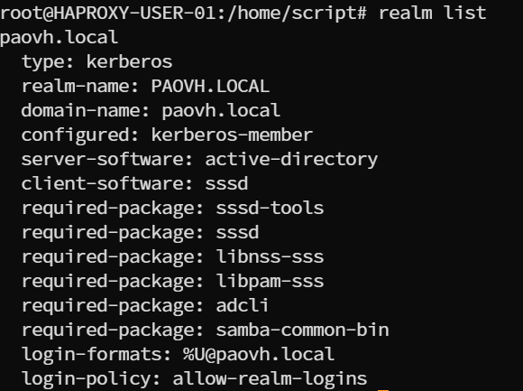

# Création d'un bastion ssh avec apache guacamole


Prérequis :
- Proxmox
- Héberger sur debian
- Guacd
- MySQL
- MariaDB
- Tomcat


## Mise en place d'une VM et sur ProxMox

### Création de la machine virtuelle dans ProxMox

importez l'iso debian dans votre pool de stockage, ensuite creez votre machine virtuelle avec l'iso précédemment ajouter, choisissez le stockage, la ram, le cpu, pour le réseau cela dépend de votre configuration.

### Configuration de debian

Une fois la machine virtuelle démarré faites l'installation de debian, choisissez votre langue, votre pays, votre clavier, votre nom de machine, votre nom d'utilisateur et votre mot de passe. Pour les packages choisissez juste SSH server, standard system utilities et apache2.
Une fois l'installation terminé, connectez vous à la vm avec votre utilisateur et votre mot de passe.


### Mettre en place les configurations réseaux sur les machines virtuelles


```bash
sudo nano /etc/network/interfaces
```
Puis renseigner la configuration réseau comme ceci, attention à bien mettre une IP différente sur chaque vms :

### Mise en place du serveur Guacamole Apache.

Ensuite installer les paquets qui permettront le bon fonctionnement de Guacamole Apache. 

```bash
sudo apt-get update
sudo apt-get install build-essential libcairo2-dev libjpeg62-turbo-dev libpng-dev libtool-bin uuid-dev libossp-uuid-dev libavcodec-dev libavformat-dev libavutil-dev libswscale-dev freerdp2-dev libpango1.0-dev libssh2-1-dev libtelnet-dev libvncserver-dev libwebsockets-dev libpulse-dev libssl-dev libvorbis-dev libwebp-dev
```

Installation du serveur Guacamole Apache dans le répertoire que vous voulez.

```bash
wget https://downloads.apache.org/guacamole/1.5.2/source/guacamole-server-1.5.2.tar.gz
```
Il faudra ensuite décompresser le fichier avec la commande :

```bash
tar -xzf guacamole-server-1.5.2.tar.gz
```

Pour l'installation du serveur guacamole on a besoin de faire une compilation et donc on va d'abord vérifier les dépendances avec la commande : 

```bash
sudo ./configure --with-init-dir=/etc/init.d
```
Ce qui ressemble à ça : 


Et ensuite on va venir initialiser la compilation : 

```bash
sudo make 
sudo make install
```
Ensuite il faut mettre à jour les liens guacamole-server et les librairies avec la commande : 

```bash
sudo ldconfig
```

Puis on va lancer le service guacd (guacamole) avec les commandes 

```bash
sudo systemctl daemon-reload
sudo systemctl start guacd
sudo systemctl enable guacd
```

On peut venir maintenant vérifier que le service est lancer avec la commande :

```bash
sudo systemctl status guacd
```


Puis on va créer l'arborescence de guacamole apache en créant les fichiers/répertoire qui permettent le bon fonctionnement de Guacamole Apache.

```bash
sudo mkdir -p /etc/guacamole/{extensions,lib}
```

### Installer Guacamole Client (Web App)

Pour la Web App de Guacamole il faut utiliser Tomcat, prenez la version que vous voulez. Pour ma part j'ai pris la version Tomcat9.

Donc on va venir installer les différents paquets de tomcat : 

```bash
sudo apt-get install tomcat9 tomcat9-admin tomcat9-common tomcat9-user
```

Ensuite on va venir installer la Web App de guacamole.

```bash
wget https://downloads.apache.org/guacamole/1.5.2/binary/guacamole-1.5.2.war
```
Et ensuite on déplace le fichier dans la librairie de Web App de tomcat9 avec cette commande : 

```bash
sudo mv guacamole-1.5.2.war /var/lib/tomcat9/webapps/guacamole.war
```

On vient ensuite relancer les services guacd et tomcat9 avec la commande :

```bash
sudo systemctl restart tomcat9 guacd
```

### Installation de la base de donnée de guacamole

Dans notre infra on a décider d'externaliser toutes les bdd dans un serveur de bdd redondé. Donc la bdd de guacamole sera externalisé. 

### Serveur de base de données

Sur le serveur de base de données on va venir créer une base de donnée "guacamole" et un user "guacamole" ayant des droits sur la base de donnée guacamole.


```bash
Pour ce connecter à la bdd faite "mysql" 
```

```bash
CREATE DATABASE guacamole;
CREATE USER 'guacamole'@'IP' IDENTIFIED BY '####';
GRANT SELECT,INSERT,UPDATE,DELETE ON guacamole.* TO 'guacamole'@'IP';
FLUSH PRIVILEGES;
EXIT;
```

### VM Guacamole 

Installer le paquet mariadb-client avec la commande :

```bash
apt install mariadb-client
```

Puis on va venir créer le fichier "guacamole.properties"

```bash
sudo nano /etc/guacamole/guacamole.properties
```

Et on va venir alimenter la configuration de guacamole selon nos besoins. 

Pour la bdd il faut renseigner : 

```bash
mysql-hostname: IP BDD
mysql-port: PORT SQL
mysql-database: NOM DE LA BDD
mysql-username: USER BDD
mysql-password: PASSWORD DU USER
```

Ensuite on va venir editer la configuration de guacd pour le rendre disponible. 

```bash
sudo nano /etc/guacamole/guacd.conf
[server] 
bind_host = 0.0.0.0
bind_port = 4822
```

Ensuite pour initialiser les nouvelles configurations apportés on va venir redémarrer les services tomcat9 guacd et mariadb. 


```bash
sudo systemctl restart tomcat9 guacd mariadb
```

Vous pouvez maintenant vous rendre sur l'interface WEB à partir de l'URL : 

```bash
http://<Adresse IP>:8080/guacamole/
```
Vous arriverez sur cette page : 


Vous pouvez vous connecter avec les mots de passes par defaut "guacadmin guacadmin".

Ensuite vous pouvez configurer vos connexions, groupes ect ect via l'interface web de guacamole.


### Liaison de votre guacamole à un AD 

Dans notre infrastructure nous disposons d'un Windows Server, avec un gestionnaire d'utilisateur et un domaine. L'idée est de pouvoir ce connecter à notre guacamole avec nos comptes AD.

Il faut premièrement aller dans l'AD et créer un utilisateur qui nous permettra de parcourir l'arborescence de l'AD, pour ma part j'ai créer le compte "Guacamole". 

Installation du plugin pour lier l'AD et Guacamole : 

```bash
wget https://downloads.apache.org/guacamole/1.5.2/binary/guacamole-auth-ldap-1.5.2.tar.gz

tar -xzf guacamole-auth-ldap-1.5.2.tar.gz

sudo mv guacamole-auth-ldap-1.5.2/guacamole-auth-ldap-1.5.2.jar /etc/guacamole/extensions

sudo systemctl restart tomcat9

On déplace le plugin dans le dossier "extensions" qu'on a créer au préalable 
```


Pour faire ceci, il faut ce rendre dans le répertoire :

```bash
nano /etc/guacamole/guacamole.properties
```

```bash
# Paramètres de l'authentification LDAP pour Active Directory
ldap-hostname: ${LDAP_HOST}
ldap-port: ${LDAP_PORT}
ldap-encryption-method: ${LDAP_ENCRYPTION_METHOD}

# DN de recherche de l'utilisateur (utilisez le compte Guacamole)
ldap-search-bind-dn: ${LDAP_SEARCH_BIND_DN}

# Mot de passe pour la recherche de l'utilisateur
ldap-search-bind-password: ${LDAP_SEARCH_BIND_PASSWORD}

# Base DN pour la recherche des utilisateurs
ldap-user-base-dn: ${LDAP_USER_BASE_DN}

# Attribut d'identification de l'utilisateur
ldap-username-attribute: ${LDAP_USERNAME_ATTRIBUTE}

# Filtre de recherche des utilisateurs
ldap-user-search-filter: ${LDAP_USER_SEARCH_FILTER}

# Extension LDAP
extension-priority: ldap

# Serveur Guacamole externe sur le VLAN du service infra 
guacd-hostname: ${GUACD_HOST}
guacd-port: ${GUACD_PORT}

```

Renseigner les informations de l'AD qui permettront de s'authentifier avec les comptes AD sur l'interfaces de guacamole.

Ici on peut voir le user guacmaole2 qui permet de parcourir l'arborescence de notre AD 


Il faut ensuite relancer tomcat9 pour pouvoir initialiser les nouvelles configuration. 

```bash
sudo systemctl restart tomcat9
```

Ensuite on va revenir encore une fois sur la page principale de guacamole via l'url : http://<Adresse IP>:8080/guacamole/

Et il faut se connecter avec les comptes AD afin de faire redescendre les connexions AD dans Guacamole. 

Comme ceci : 


Connectez-vous 

Par défaut vous aurez aucun droit, il faudra configurer les droits et les connexions ssh/rdp... par utilisateurs ensuite via l'interface admin de Guacamole avec le compte admin par defaut. 


On peut voir ici les comptes AD redescendre dans guacamole juste ici : 


Voici un exemple de configuration par utilisateur terminé : 


Et voici une exemple de création de connexion SSH (à vous de configurer comme vous le souhaitez votre interface avec des groupes ou pas...)


On vient renseigner l'IP, le port et la clé privé qui permettra la connexion SSH entre les VMS depuis chaque utilisateurs.

### Connexion SSH aux VMS depuis guacamole en vérifiant les clés ssh depuis l'AD et paramétrer la redescente des comptes AD dans les VMS avec leurs répertoires

L'obectif de cette partie est de pouvoir s'authentifier sur les vms via nos compte AD tout en laissant la partie publique de nos clés dans l'AD via l'editeur d'attribue "altSecurityIdentities" qui permet donc de stocker les clés publiques. 

Le but est que la vérification des clés se fassent depuis l'AD et que seulement après le compte AD resdecende dans la VM avec le bon répertoire. /home/domaine/user

Prérequis :

- Windows Server
- guacamole
- kerberos
- sshkeygen
- sssd ssh sshd
- pam.d
- realm 
- adcli 

Premièrement on va venir déployer nos clés ssh sur toutes les VMS pour chaque utilisateurs avec ssh-keygen.

Avec la commande : 

```bash
ssh-keygen -t rsa -b 2048 -C "admt1-tsbe@paovh.local"
```

Pour ma part j'ai décider de créer un répertoire spécifiques pour la génération des clés dans /var/lib/ssh/keys/$user

On peut donc voir ici toutes les clés privées/publiques de tout nos utilisateurs générer avec ssh-keygen :


On reviendra les utiliser plus tard.

Ensuite on va venir lier notre VM linux (debian) au domaine PAOVH.LOCAL (le nôtre). Pour ceci on aura besoin d'installer plusieurs paquets car nous avons besoin de différents services en plus qui permettront la liaison à l'AD. 

Les packages sont à installer sont : 

sssd adcli realm krb5-user sssd-tools libnss-sss libpam-sss

avec la commande :

```bash
apt install sssd adcli realm krb5-user sssd-tools sssd libnss-sss libpam-sss
```
Une fois les paquets installer on va venir commencer la configuration des différents modules comme SSSD SSHD KERBEROS PAM.D 

Pour sssd on va venir supprimer le fichier de conf sssd.conf dans /etc/sssd/sssd.conf puis le recréer avec la commande :

```bash
nano /etc/sssd/sssd.conf
```
Voici un exemple de configuration de sssd (notre configuration)

```bash
[sssd]
domains = paovh.local
config_file_version = 2
services = nss, pac, pam, ssh

[domain/paovh.local]
default_shell = /bin/bash
krb5_store_password_if_offline = False
cache_credentials = False
krb5_realm = PAOVH.LOCAL
realmd_tags = manages-system joined-with-adcli
id_provider = ad
auth_provider = ad
access_provider = ad
chpass_provider = ad
fallback_homedir = /home/%d/%u
ad_domain = paovh.local
use_fully_qualified_names = True
ldap_id_mapping = True
ldap_user_extra_attrs = altSecurityIdentities:altSecurityIdentities
ldap_user_ssh_public_key = altSecurityIdentities
ldap_use_tokengroups = True
ad_gpo_access_control = disabled
```
une fois la configuration faite on va venir enregistrer le fichier et lui attribuer ses droits avec la commande :

```bash
chmod 600 sssd.conf
```
Puis on va venir relancer le service sssd avec la commande :

```bash
systemctl restart sssd
```

Ensuite il faut configurer Kerberos donc pour cela il faut se rendre dans /etc/ et supprimer le fichier krb5.conf pour ensuite le recréer avec la commande nano comme juste avant. 

Et dedans on va appliquer la configuration en lien avec l'infrastructure dont nous disposons : 

```bash
[libdefaults]
    default_realm = PAOVH.LOCAL
    dns_lookup_realm = false
    dns_lookup_kdc = false
    renew_lifetime = 1d
    rdns = false

[realms]
    PAOVH.LOCAL = {
        admin_server = AD1.VM.DSI.paovh.local
        kdc = AD1.VM.DSI.paovh.local
    }

[domain_realm]
    .paovh.local = PAOVH.LOCAL

[logging]
    default = SYSLOG
```

une fois la configuration faite on va venir enregistrer le fichier et lui attribuer ses droits avec la commande :

```bash
chmod 644 krb5.conf
```
Puis on va venir relancer le service sssd avec la commande :

```bash
systemctl restart krb5-user
```
Ensuite faite la commande : 

```bash
realm list
```
Pour voir si vous êtes bien lier à votre domaine. 



Ensuite on va venir paramétrer sshd pour nos clés RSA. 

On va venir lui spécifier quels algorithmes utiliser dans /etc/ssh/sshd_config en rajoutant ceci : 

```bash
AuthorizedKeysCommand /usr/bin/sss_ssh_authorizedkeys
AuthorizedKeysCommandUser root
HostkeyAlgorithms +ssh-rsa,ssh-dss
PubkeyAcceptedAlgorithms +ssh-rsa
```

résultat : 


Et on va venir aussi configurer dans pam.d/common-session la manière dont les répertoires vont être créer à la redescente des comptes avec la ligne de commande : 

```bash
session required pam_mkhomedir.so skel=/etc/skel/ umask=0022
```

résultat : 


Ce qui nous permettra d'avoir ceci comme répertoire une fois que l'utilisateur s'est connecté au moins une fois : 


Donc maintenant on va venir ajouter les clés privées dans guacamole pour chaque user pour chaque connexion dans l'onglet Clé privée:


Puis la partie publique sera stockées dans l'AD à l'endroit indiquer précédemment dans nos différentes configuration : 

Dans l'AD ce sera dans les editeurs d'attribues de chaque utilisateurs comem ceci : 


Et ensuite on vient dire à sssd d'utiliser cet editeur d'attribut dans le fichier de conf sssd.conf avec les commandes que l'on a vu un peu plus haut dans le fichier de configurations : 


Redémarrer les services guacd tomcat9 du serveur guacamole ainsi que vos services sssd sshd ssh krb5-user sur vos vms. Et ensuite vous pouvez tester une connexion ssh en CLI (donc sans l'interface web de guac c'est pour cela que je spécifie ou sont les clés ssh) vers un hôte disposant de la configuration que l'on a apportées juste au dessus comme ceci : 


On peut voir que je suis sur guacamole et que je suis ensuite sur la vm GLPI avec mon utilisateur AD. 

Et pour finir on va donc maintenant tester les connexions dans l'interface web de guacd.

Résultat dans notre navigateur nous obtenons une connexion ssh avec comme identifiant un compte AD dans notre navigateur depuis l'interface web de guacamole :


Voici différentes connexions ssh :


Ce TP a été prévu pour la sécurisation de notre infrastructure. Nous bloquons toutes les tentatives de connexions ssh externe au guacamole. Et nous autorisons les connexions ssh seulement depuis ce bastion ssh.