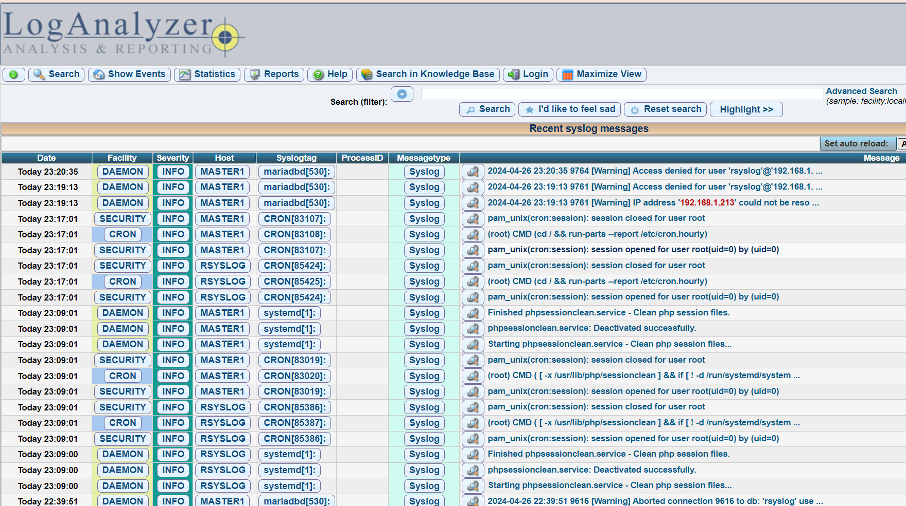

# Configuration et installation du serveur RSYSLOG/LOGANALYZER avec AUDITD


Ce projet vise à centraliser les logs de toute notre infrastructure via un serveur RSYSLOG et les visualiser avec LOGANALYZER . En plus de cela, nous cherchons à surveiller en temps réel les commandes exécutées par chaque utilisateur avec AUDITD.


Prérequis :
- Proxmox
- Héberger sur debian
- MariaDB
- MySQL
- Rsyslog
- Loganalyzer
- Apache
- auditd

## Mise en place debian sur ProxMox

### Création de la machine virtuelle dans ProxMox

importez l'iso debian dans votre pool de stockage, ensuite creez votre machine virtuelle avec l'iso précédemment ajouter, choisissez le stockage, la ram, le cpu, pour le résaux cela dépend de votre configuration.

Répétez l'opération pour la deuxième vm

### Configuration de debian

Une fois la machine virtuelle démarré faites l'installation de debian, choisissez votre langue, votre pays, votre clavier, votre nom de machine, votre nom d'utilisateur et votre mot de passe. Pour les packages choisissez juste SSH server, standard system utilities et apache2.
Une fois l'installation terminé, connectez vous en SSH avec votre utilisateur et votre mot de passe.


### Mettre en place les configurations réseaux sur les machines virtuelles

Sur les deux vms faites : 

```bash
sudo nano /etc/network/interfaces
```
Puis renseigner la configuration réseau.


### Création de la base de données sur nos serveurs de base de données

Connexion à mariadb : 

mysql -u root -p

Création de la base de données :

```bash
CREATE DATABASE rsyslog;

```
Création de l'utilisateur pour la base de données rsyslog :

```bash
CREATE USER 'rsyslog'@'172.20.3.82' IDENTIFIED BY 'rsyslog';

```
Accorder les privilèges à l'utilisateur rsyslog sur la base de données rsyslog : 
```bash
GRANT ALL PRIVILEGES ON rsyslog.* TO 'rsyslog'@'172.20.3.82';
```

Voila la base de données est maintenant créer.


### Installation de LOGANALYZER

Nous allons commencer par mettre à jour notre VM puis venir installer loganalyzer avec les commandes :

Pour ma part j'ai choisi de créer le répertoire srv et de venir installer loganalyzer dedans. 

Ce déplacer dans le répertoire : 

```bash
sudo mkdir -p /srv/ 
```
Attribution des droits au répertoires : 

```bash
sudo chmod 755 -R /srv/ 
```
Installation de loganalyzer dans le repertoire srv

```bash
sudo wget -O /srv/loganalyzer-4.1.13.tar.gz http://download.adiscon.com/loganalyzer/loganalyzer-4.1.13.tar.gz 
```
Décompression de loganalyzer dans /srv : 

```bash
sudo tar -zxvf /srv/loganalyzer-4.1.13.tar.gz -C /srv/ 
```
Création du répertoire loganalyzer dans /var/www/html/loganalyzer

```bash
sudo mkdir -p /var/www/html/loganalyzer 
```
Attribution des droits au répertoire :

```bash
sudo chmod 755 -R /var/www/html/loganalyzer 
```
En utilisant rsync de cette manière, tous les fichiers et répertoires du répertoire source /srv/loganalyzer-4.1.13/src/ seront synchronisés vers le répertoire de destination /var/www/html/loganalyzer. Cela garantit que le contenu de /var/www/html/loganalyzer est identique à celui de /srv/loganalyzer-4.1.13/src/, en préservant les attributs des fichiers comme les permissions.

```bash
sudo rsync -av /srv/loganalyzer-4.1.13/src/ /var/www/html/loganalyzer 
```

Attribution de l'utilisateur www-data (apache) au répertoire :

```bash
sudo chown -R www-data:www-data /var/www/html/loganalyzer"
```

L'installation de loganlyzer est maintenant finis. Il faut donc ce rendre sur l'interface WEB via l'URL http://localhost/loganalyzer

Lorsque vous arrivez sur la page web il y a une configuration à faire.

Clique sur "here" pour débuter l'installation.


Ensuite il faudra cliquer sur next (il vérifie les permissions).


Ensuite il faudra cliquer sur next (il vérifie les permissions au fichier /config.php.


Ensuite cliquer sur YES à ENABLE USER DATABASE puis renseigner les informations de votre serveur de base de données (ne pas prendre en compte les variables que j'ai mis). Ensuite cliquer sur next afin qu'il tente une connexion vers le serveur de base de données.


Ensuite il va venir créer les tables dans la bdd rsyslog quand vous allez cliquer sur next.


Ensuite il refait un test de nouveau lorsque vous cliquer sur next. 


Ensuite il va vous demander de créer un compte pour la visualisation des logs mettez votre user mot de passe.


Ensuite veuillez sélectionner à Source type MYSQL Native puis renseigner à nouveau les informations de votre serveur de base de données et pour les tablename veuillez bien mettre SystemEvents.


Et voila vous pouvez cliquer sur finish et vous avez finit l'installation de LogAnalyzer.


<!--  -->

