# Configuration et installation du serveur RSYSLOG/LOGANALYZER avec AUDITD


Ce projet vise à centraliser les logs de toute notre infrastructure via un serveur RSYSLOG et les visualiser avec LOGANALYZER . En plus de cela, nous cherchons à surveiller en temps réel les commandes exécutées par chaque utilisateur avec AUDITD.


Prérequis :
- Proxmox
- Héberger sur debian
- MariaDB
- MySQL
- Rsyslog
- Loganalyzer
- Apache
- auditd

## Mise en place debian sur ProxMox

### Création de la machine virtuelle dans ProxMox

importez l'iso debian dans votre pool de stockage, ensuite creez votre machine virtuelle avec l'iso précédemment ajouter, choisissez le stockage, la ram, le cpu, pour le résaux cela dépend de votre configuration.

Répétez l'opération pour la deuxième vm

### Configuration de debian

Une fois la machine virtuelle démarré faites l'installation de debian, choisissez votre langue, votre pays, votre clavier, votre nom de machine, votre nom d'utilisateur et votre mot de passe. Pour les packages choisissez juste SSH server, standard system utilities et apache2.
Une fois l'installation terminé, connectez vous en SSH avec votre utilisateur et votre mot de passe.


### Mettre en place les configurations réseaux sur les machines virtuelles

Sur les deux vms faites : 

```bash
sudo nano /etc/network/interfaces
```
Puis renseigner la configuration réseau.


### Création de la base de données sur nos serveurs de base de données

Connexion à mariadb : 

mysql -u root -p

Création de la base de données :

```bash
CREATE DATABASE rsyslog;

```
Création de l'utilisateur pour la base de données rsyslog :

```bash
CREATE USER 'rsyslog'@'172.20.3.82' IDENTIFIED BY 'rsyslog';

```
Accorder les privilèges à l'utilisateur rsyslog sur la base de données rsyslog : 
```bash
GRANT ALL PRIVILEGES ON rsyslog.* TO 'rsyslog'@'172.20.3.82';
```

Voila la base de données est maintenant créer.


### Installation de LOGANALYZER

Nous allons commencer par mettre à jour notre VM puis venir installer loganalyzer avec les commandes :

Pour ma part j'ai choisi de créer le répertoire srv et de venir installer loganalyzer dedans. 

Ce déplacer dans le répertoire : 

```bash
sudo mkdir -p /srv/ 
```
Attribution des droits au répertoires : 

```bash
sudo chmod 755 -R /srv/ 
```
Installation de loganalyzer dans le repertoire srv

```bash
sudo wget -O /srv/loganalyzer-4.1.13.tar.gz http://download.adiscon.com/loganalyzer/loganalyzer-4.1.13.tar.gz 
```
Décompression de loganalyzer dans /srv : 

```bash
sudo tar -zxvf /srv/loganalyzer-4.1.13.tar.gz -C /srv/ 
```
Création du répertoire loganalyzer dans /var/www/html/loganalyzer

```bash
sudo mkdir -p /var/www/html/loganalyzer 
```
Attribution des droits au répertoire :

```bash
sudo chmod 755 -R /var/www/html/loganalyzer 
```
En utilisant rsync de cette manière, tous les fichiers et répertoires du répertoire source /srv/loganalyzer-4.1.13/src/ seront synchronisés vers le répertoire de destination /var/www/html/loganalyzer. Cela garantit que le contenu de /var/www/html/loganalyzer est identique à celui de /srv/loganalyzer-4.1.13/src/, en préservant les attributs des fichiers comme les permissions.

```bash
sudo rsync -av /srv/loganalyzer-4.1.13/src/ /var/www/html/loganalyzer 
```

Attribution de l'utilisateur www-data (apache) au répertoire :

```bash
sudo chown -R www-data:www-data /var/www/html/loganalyzer"
```

L'installation de loganlyzer est maintenant finis. Il faut donc ce rendre sur l'interface WEB via l'URL http://localhost/loganalyzer

Lorsque vous arrivez sur la page web il y a une configuration à faire.

Clique sur "here" pour débuter l'installation.

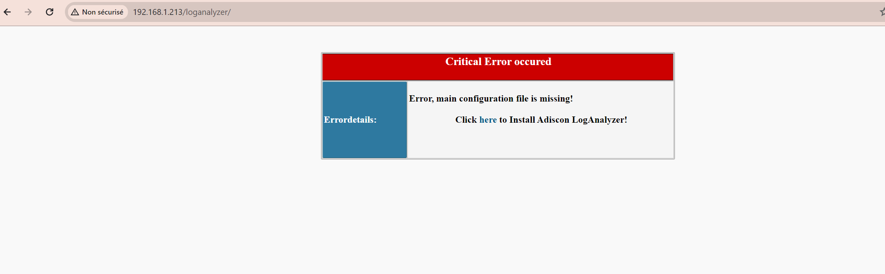

Ensuite il faudra cliquer sur next (il vérifie les permissions).


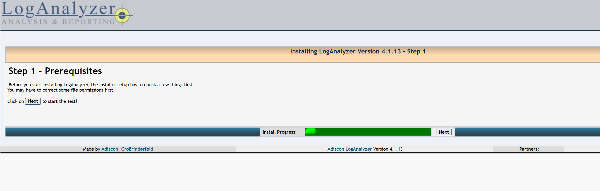

Ensuite il faudra cliquer sur next (il vérifie les permissions au fichier /config.php.

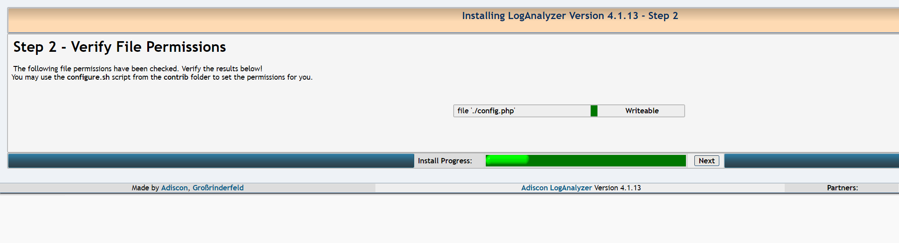

Ensuite cliquer sur YES à ENABLE USER DATABASE puis renseigner les informations de votre serveur de base de données (ne pas prendre en compte les variables que j'ai mis). Ensuite cliquer sur next afin qu'il tente une connexion vers le serveur de base de données.

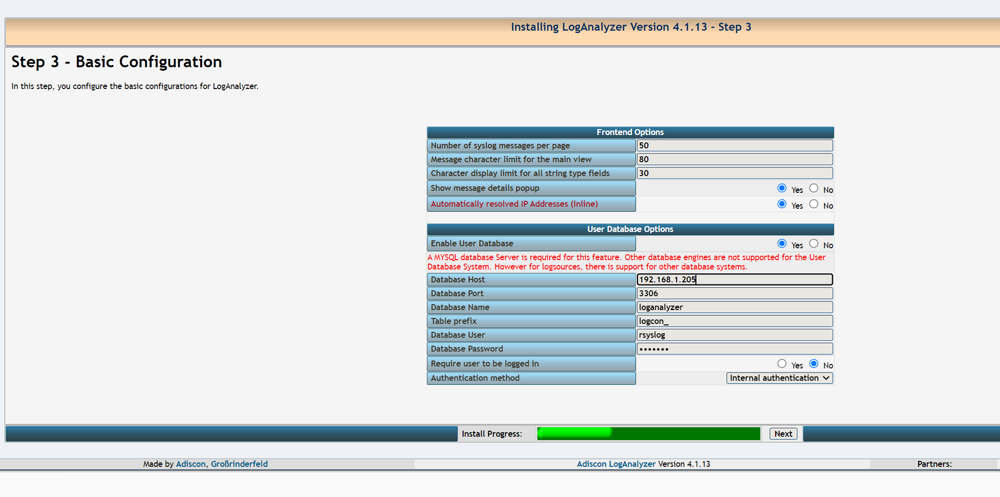


Ensuite il va venir créer les tables dans la bdd rsyslog quand vous allez cliquer sur next.

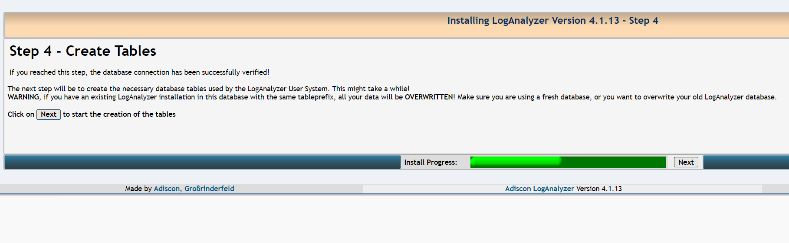

Ensuite il refait un test de nouveau lorsque vous cliquer sur next. 

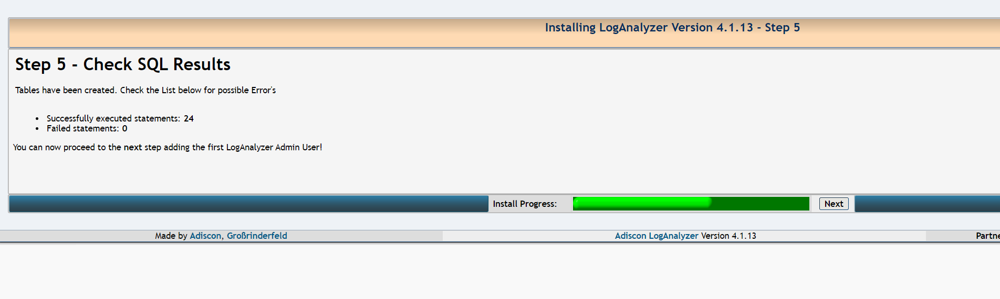

Ensuite il va vous demander de créer un compte pour la visualisation des logs mettez votre user mot de passe.

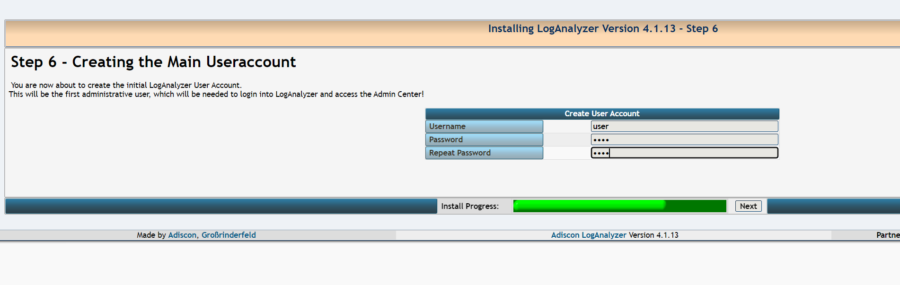

Ensuite veuillez sélectionner à Source type MYSQL Native puis renseigner à nouveau les informations de votre serveur de base de données et pour les tablename veuillez bien mettre SystemEvents.

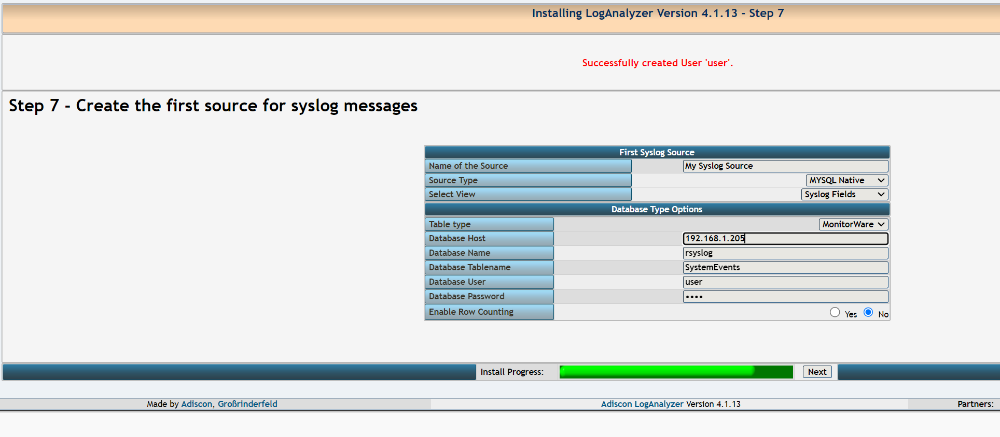

Et voila vous pouvez cliquer sur finish et vous avez finit l'installation de LogAnalyzer.

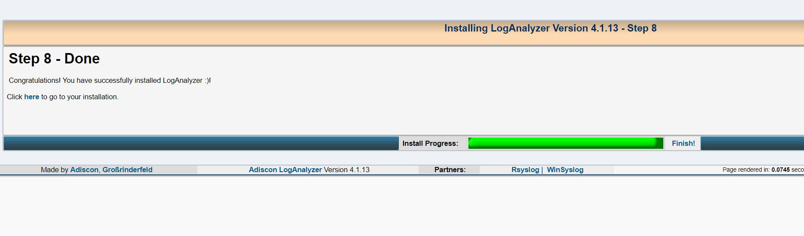

<!--  -->

### Installation de Rsyslog 

Pour l'installation de Rsyslog nous allons avoir besoin de 3 paquets : 

```bash
apt install rsyslog php(version) mariadb-client
apt update && upgrade
systemctl restart rsyslog.service mariadb.service

```

Ensuite nous allons procéder à la configuration du serveur rsyslog. 

Nous allons nous rendre dans : 

```bash
cd /etc/
rm rsyslog.conf 
nano rsyslog.conf
```
Et nous allons attribuer cette configuration (à vous d'adapter selon vos besoins): 

```bash
# /etc/rsyslog.conf configuration file for rsyslog
#
# For more information install rsyslog-doc and see
# /usr/share/doc/rsyslog-doc/html/configuration/index.html


#################
#### MODULES ####
#################

module(load="imuxsock") # provides support for local system logging
module(load="imklog")   # provides kernel logging support
#module(load="immark")  # provides --MARK-- message capability
module(load="imfile" PollingInterval="10") # file support

# provides UDP syslog reception
module(load="imudp")
input(type="imudp" port="514")

# provides TCP syslog reception
module(load="imtcp")
input(type="imtcp" port="514")

### REMONTER DES COMMANDES UTILISATEURS VIA AUDITD###
input(type="imfile" File="/var/log/audit/audit.log" Tag="AUDIT" Severity="info" Facility="local7")


###########################
#### GLOBAL DIRECTIVES ####
###########################

#
# Set the default permissions for all log files.
#
$FileOwner root
$FileGroup adm
$FileCreateMode 0640
$DirCreateMode 0755
$Umask 0022

#
# Where to place spool and state files
#
$WorkDirectory /var/spool/rsyslog

#
# Include all config files in /etc/rsyslog.d/
#
$IncludeConfig /etc/rsyslog.d/*.conf
#if $msg contains 'audit_key' then /var/log/audit/audit.log


###############
#### RULES ####
###############

#
# Log anything besides private authentication messages to a single log file
#
*.*;auth,authpriv.none          -/var/log/syslog

#
# Log commonly used facilities to their own log file
#
auth,authpriv.*                 /var/log/auth.log
cron.*                          -/var/log/cron.log
kern.*                          -/var/log/kern.log
mail.*                          -/var/log/mail.log
user.*                          -/var/log/user.log

#
# Emergencies are sent to everybody logged in.
#
*.emerg                         :omusrmsg:*

#:programname, isequal, "auditd" /var/log/audit/audit.log
#:programname, isequal, "auditd" /var/log/audit/audit.log
# Dans /etc/rsyslog.conf ou un fichier de configuration similaire
#:msg, contains, "audit" /var/log/audit/audit.log
```

Ensuite il faut configurer rsyslog pour qu'il envoie les logs dans la base de données pour ce faire il faut ce rendre ici : 

```bash
cd /etc/rsyslog.d/
nano mysql.oonf
```
Et rentrer cette configuration (à vous d'adaptez encore une fois selon votre infrastructure):

```bash
### Configuration file for rsyslog-mysql
### Changes are preserved

##module (load="ommysql")
##*.* action(type="ommysql" server="localhost" db="Syslog" uid="rsyslog" pwd="")
module (load="ommysql")
*.* action(type="ommysql" server="172.20.2.20" db="rsyslog" uid="user" pwd="user")
module (load="ommysql")
*.* action(type="ommysql" server="172.20.2.20" db="rsyslog" uid="user" pwd="user")
```

Puis on va venir relancer notre service rsyslog :

```bash
sudo systemctl restart rsyslog
```

### Déploiement de RSYSLOG

Une fois que le serveur est configurer il faut maintenant configurer les vms afin qu'elles envoie leurs logs au serveur rsyslog. 

Pour ce faire il faut leurs installer rsyslog avec la commande : 

```bash
Apt install rsyslog
```

Puis on va venir ensuite apporter cette configuration (à adapter selon l'infra que vous utilisez):

```bash
# /etc/rsyslog.conf configuration file for rsyslog
#
# For more information install rsyslog-doc and see
# /usr/share/doc/rsyslog-doc/html/configuration/index.html


#################
#### MODULES ####
#################

module(load="imuxsock") # provides support for local system logging
module(load="imklog")   # provides kernel logging support
module(load="imfile" PollingInterval="10")      # provides file support
#qmodule(load="immark")  # provides --MARK-- message capability

# provides UDP syslog reception
#module(load="imudp")
#input(type="imudp" port="514")

# provides TCP syslog reception
#module(load="imtcp")
#input(type="imtcp" port="514")

input(type="imfile" File="/var/log/audit/audit.log" Tag="AUDIT" Severity="info" Facility="local7")


###########################
#### GLOBAL DIRECTIVES ####
###########################

#
# Set the default permissions for all log files.
#
$FileOwner root
$FileGroup adm
$FileCreateMode 0640
$DirCreateMode 0755
$Umask 0022

#
# Where to place spool and state files
#
$WorkDirectory /var/spool/rsyslog

#
# Include all config files in /etc/rsyslog.d/
#
$IncludeConfig /etc/rsyslog.d/*.conf

#if $msg contains 'audit_key' then /var/log/audit/audit.log


###############
#### RULES ####
###############

# Forward all with TCP on 172.20.3.82:514
*.* action(type="omfwd" target="172.20.3.82" port="514" protocol="tcp")

#
# Log anything besides private authentication messages to a single log file
#
*.*;auth,authpriv.none          -/var/log/syslog

#
# Log commonly used facilities to their own log file
#
auth,authpriv.*                 /var/log/auth.log
cron.*                          -/var/log/cron.log
kern.*                          -/var/log/kern.log
mail.*                          -/var/log/mail.log
user.*                          -/var/log/user.log

#
# Emergencies are sent to everybody logged in.
#
*.emerg                         :omusrmsg:*
#*.* @@172.20.3.82:514


# Rediriger tous les messages du journal d'audit vers rsyslog
#:programname, isequal, "auditd" @172.20.3.82:514

#:programname, isequal, "auditd" /var/log/audit.log
# Dans /etc/rsyslog.conf ou un fichier de configuration similaire
#:msg, contains, "audit" @172.20.3.82:514

```

Une fois ce fichier de configuration déployer sur les différentes vms le déploiement de rsyslog est terminer. 

Voici un résultat de consultation de log dans loganalyzer : 

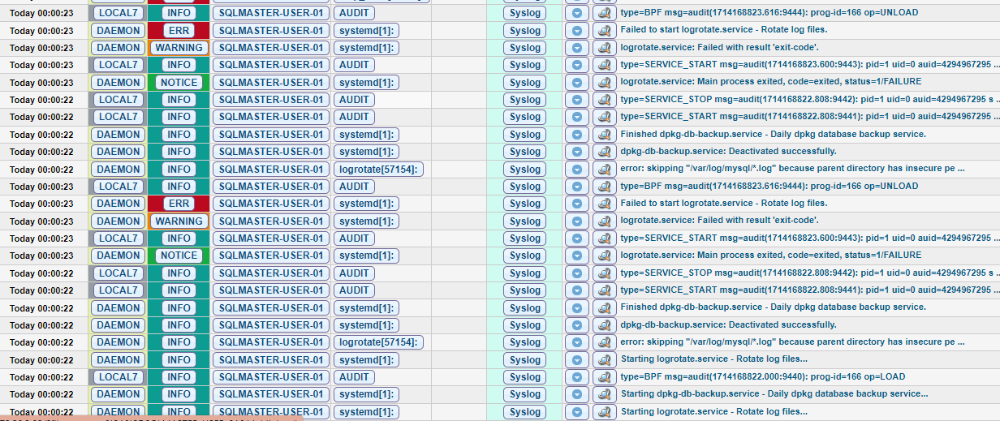


### Installation de auditd afin de récolter les commandes utilisateurs

Ce projet à pour but de remonter les commandes des différents users des vms dans l'interface web de loganalyzer. 

Pour ce faire on va venir installer un serveur auditd sur rsyslog. 


Installation de auditd : 

```bash
apt install auditd
```

Configuration du serveur auditd : 

```bash
#
# This file controls the configuration of the audit daemon
#

local_events = yes
write_logs = yes
log_file = /var/log/audit/audit.log
log_group = adm
log_format = ENRICHED
flush = INCREMENTAL_ASYNC
freq = 50
max_log_file = 8
num_logs = 5
priority_boost = 4
name_format = NONE
##name = mydomain
max_log_file_action = ROTATE
space_left = 75
space_left_action = SYSLOG
verify_email = yes
action_mail_acct = root
admin_space_left = 50
admin_space_left_action = SUSPEND
disk_full_action = SUSPEND
disk_error_action = SUSPEND
use_libwrap = yes
##tcp_listen_port = 60
tcp_listen_queue = 5
tcp_max_per_addr = 1
##tcp_client_ports = 1024-65535
tcp_client_max_idle = 0
transport = TCP
krb5_principal = auditd
##krb5_key_file = /etc/audit/audit.key
distribute_network = no
q_depth = 2000
overflow_action = SYSLOG
max_restarts = 10
plugin_dir = /etc/audit/plugins.d
end_of_event_timeout = 2

```

puis enregistrer et redemarrer auditd avec la commande :

```bash
systemctl restart auditd
```

Déploiement de auditd sur les vms clientes avec les règles adéquates : 

Installation de auditd

```bash
apt install auditd
```
Paramétrage des règles d'enregistrement : 

```bash
nano /etc/audit/rules.d/audit.rules 
```

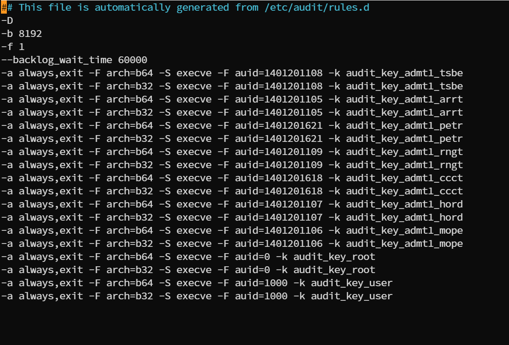

Voici les règles appliquer à tout nos users AD. 

Et ensuite il faut venir dans le rsyslog client ajouter la ligne : 

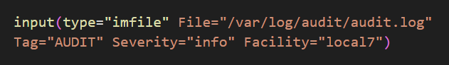

qui permet donc l'envoie des logs de auditd dans rsyslog.

Voici un exemple : 

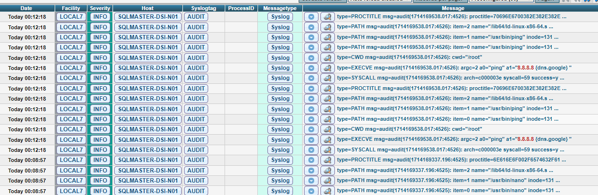

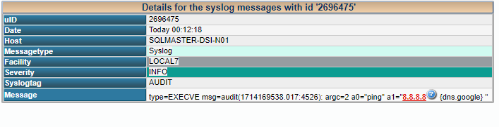


Et voila votre déploiement de rsyslog/auditd est maintenant fait et vous pouvez visualiser les logs depuis loganalyzer.