# Déploiement de Zabbix avec Docker

Environnement :

- Debian 12
- Docker
- Portainer 
- Zabbix-server
- Mysql
- Mariadb
- Zabbix-agent
- Proxmox

## Mise en place de Docker :

[Source](https://docs.docker.com/engine/install/debian/)

Mise à jour du système
```bash
sudo apt-get update
```


Installation des paquets ca-certificates curl gnupg
```bash
sudo apt-get install ca-certificates curl gnupg
```

Création du répertoire avec les autorisations appropriés
```bash
sudo install -m 0755 -d /etc/apt/keyrings
```

```bash
curl -fsSL https://download.docker.com/linux/debian/gpg | sudo gpg --dearmor -o /etc/apt/keyrings/docker.gpg
```

Attribution des autorisations au fichier docker.gpg

```bash
sudo chmod a+r /etc/apt/keyrings/docker.gpg
```

Ajout du référentiel docker au source APT
```bash
echo \ "deb [arch="$(dpkg --print-architecture)" signed-by=/etc/apt/keyrings/docker.gpg] https://download.docker.com/linux/debian \ "$(. /etc/os-release && echo "$VERSION_CODENAME")" stable" | \
```

Ces commandes ajoute une entrée qui spécifie le référentiel Docker à utiliser pour les mises à jours et les installations de paquets docker + maj système
```bash
sudo tee /etc/apt/sources.list.d/docker.list > /dev/null
sudo apt-get update
```

Installation du paquet docker
```bash
sudo apt-get install docker-ce docker-ce-cli containerd.io docker-buildx-plugin docker-compose-plugin
```

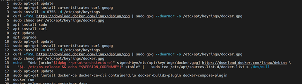

Volume pour portainer
```bash
docker volume create portainer_data
```

Lancement de portainer

```bash
docker run -d -p 8000:8000 -p 9443:9443 --name portainer --restart=always -v /var/run/docker.sock:/var/run/docker.sock -v portainer_data:/data portainer/portainer-ee:latest
```

## Connexion à l’interface web de Portainer :

Tapper ça http://localhost:9443 dans une URL

Vous arrivez sur la page de log

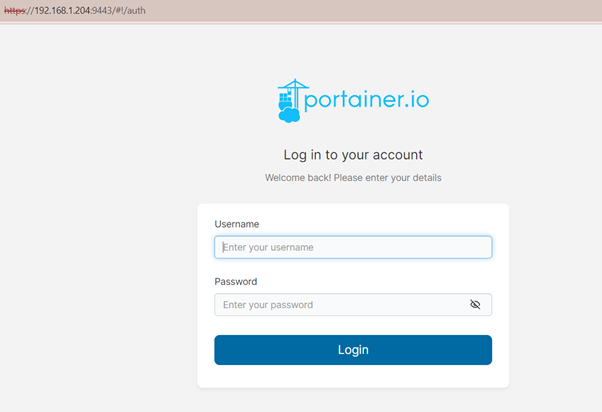

Connectez-vous **attention vous devez disposer d’une licence**

Ensuite nous allons mettre en place Zabbix via un docker-compose

Suite à la connexion vous arrivez ici :

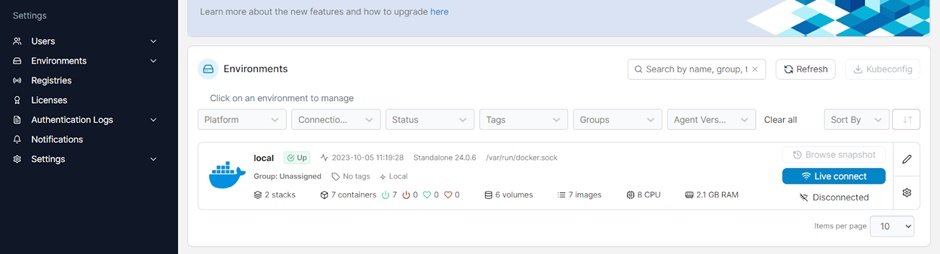

Cliquer sur local, vous arrivez ici :

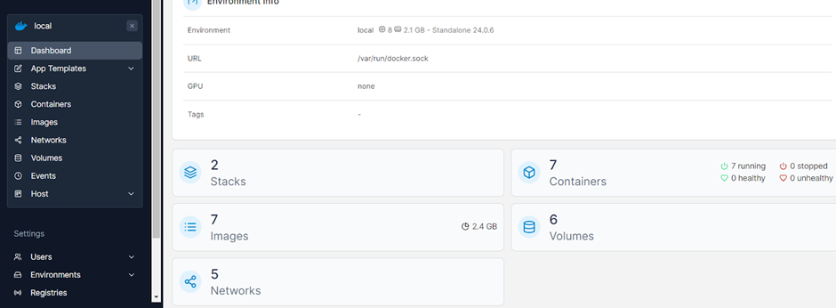

Ensuite aller dans Stacks puis Editor et renseignez votre Docker compose

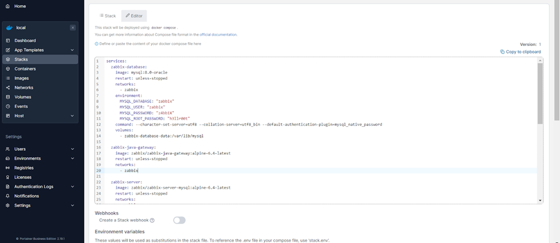

Le docker-compose en détail est fourni en fichier texte.

Ensuite il faut aller sur zabbix via l’ip de la machine + le port que vous avez attribué à votre serveur zabbix. Vous arriverez sur une page de log rentrée les informations en lien avec l’utilisateur créer en BDD.

Puis vous arriverez ici :

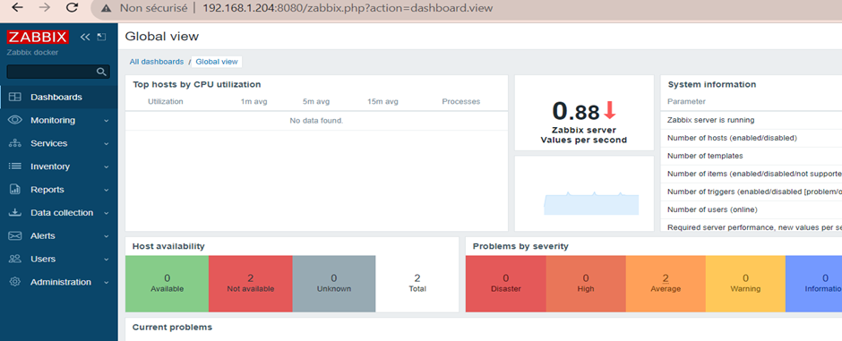

Ensuite il faudra ajouter la machine que vous souhaitez supervisez avec votre zabbix.

## Enregistrement d’un hôte Zabbix et application d’un template adapté pour la collecte d’informations

### Pour linux

Pour cela il faut d’abord installer l’agent sur votre machine :

```bash
apt install zabbix-agent
```

Ensuite éditer le fichier de configuration zabbix_agentd.conf avec la commande 
**`nano`**
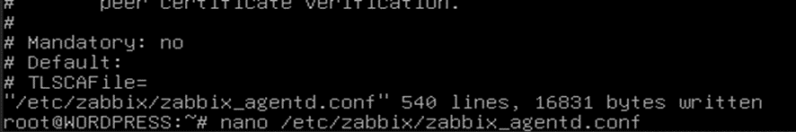

Et il faudra venir éditer la ligne : `Server=`

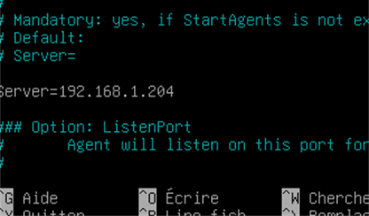

Puis redémarrer le service zabbix-agent.service

`systemctl restart zabbix-agent.service`


### Pour Linux et Windows

Ensuite, sur Zabbix, vous allez créer un host comme ceci :

1. Cliquez sur "Create Host" puis entrez les informations concernant l'host (l'équipement) à ajouter.

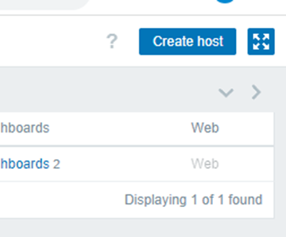

2. Renseignez le port 10050 qui correspond au port sur lequel écoute le zabbix-agent que vous avez installé sur l'host ou les hosts.

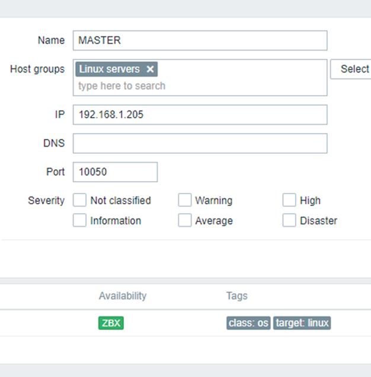

3. Sélectionnez une template pour que Zabbix puisse appliquer les ajouts d'éléments/informations de l'équipement en fonction de la template. Dans mon cas, j'ai mis la template "Operating systems" (par défaut) + Linux Zabbix Agent, ce qui spécifie par quel moyen Zabbix récupère les informations.


4. Vérifiez ensuite que l'Host a été ajouté dans Data collection => host.

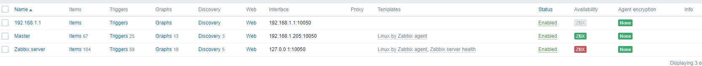

### Pour Windows

Pour le bon fonctionnement, j'ai désactivé le pare-feu sur la machine Windows. Il est recommandé de plutôt créer des règles de pare-feu local sur la machine Windows afin de faire des règles entrantes sur le port 10051 (Serveur Zabbix) et sortantes sur le port 10050 (Agent Zabbix).

1. Rendez-vous sur [https://www.zabbix.com/download_agents](https://www.zabbix.com/download_agents) et installez l'agent Zabbix.
2. Double-cliquez sur l'exécutable.
   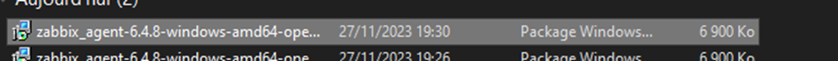
3. Appliquez la configuration lors du setup :
   - Nom de l'host (il apparaîtra dans Zabbix)
   - IP du serveur Zabbix
   - Port de l'agent Zabbix
   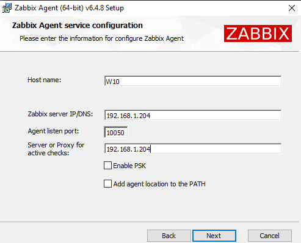
4. Suivez les étapes suivantes.

On peut vérifier que l'agent Zabbix est en fonction dans le gestionnaire des tâches puis "services" et rechercher Zabbix Agent.

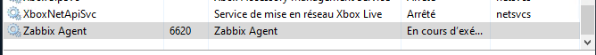


[Ensuite, ce sera le même principe que la machine Linux pour ajouter l'hôte Windows dans Zabbix](#enregistrement-dun-hôte-zabbix-et-application-dun-template-adapté-pour-la-collecte-dinformations). Il faudra juste faire attention au template utilisé et bien spécifier que c'est un Windows.

Voici un exemple de la collecte d'informations après l'ajout d'une machine dans Zabbix.

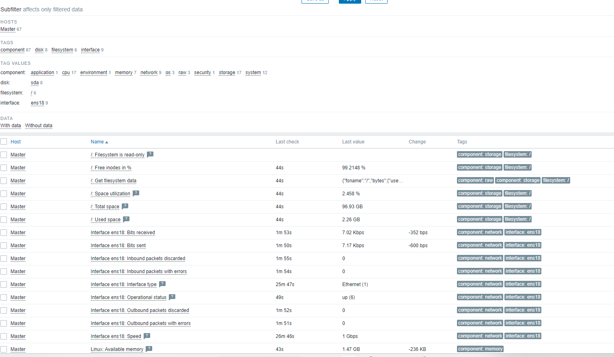

## 2. B Découvertes des hôtes sur un réseau domestique

1. Première étape il faudra se rendre dans : 

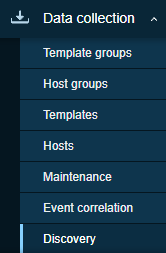

2. Puis il faudra créer une règle de découverte il faut cliquer sur “create discovery rule” en haut à droite.

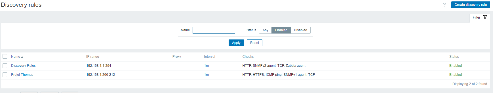

3. Ensuite vous arriverez ici : 

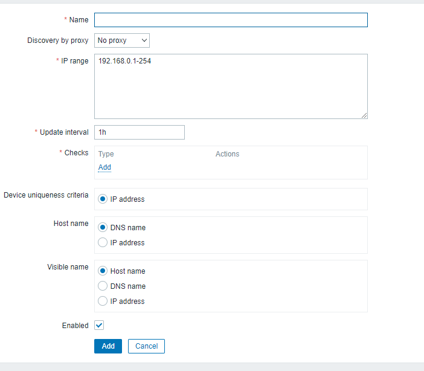


    1. Définir un nom à votre règle
    2. Définir une range d’ip en fonction des appareils que vous voulez monitorer
    3. Ensuite vous définirez un interval de temps pour l’application de la règle
    4. Dans “Check” vous lui spécifier les différents type de vérifications à faire, vous pouvez filtrer par services/ports

Ensuite ça vous donnera un résultat comme celui ci en fonction de ce que vous voulez renseigner :

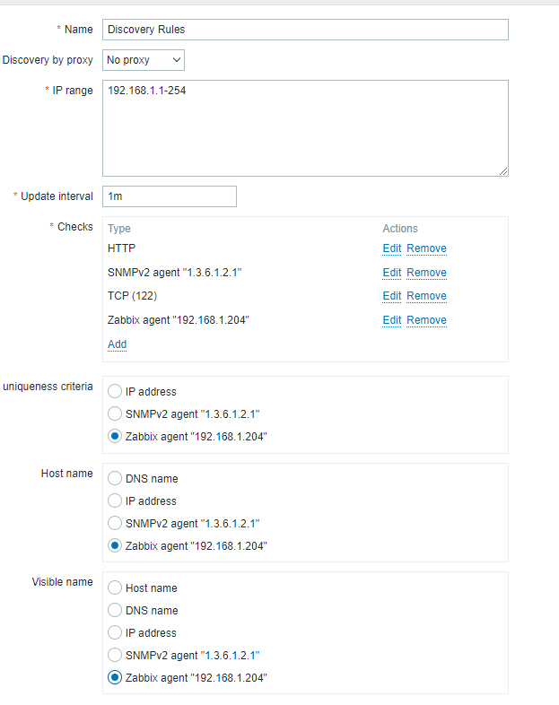

Vous pouvez évidemment ajouter autant de règles que vous le souhaitez, ensuite il faut faire “Apply”  


4. Ensuite vous allez vous rendre dans Alerts, Actions, discovery actions pour créer une action de découverte

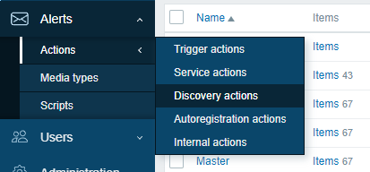

5. Ensuite vous cliquez sur “create action” en haut à droite.

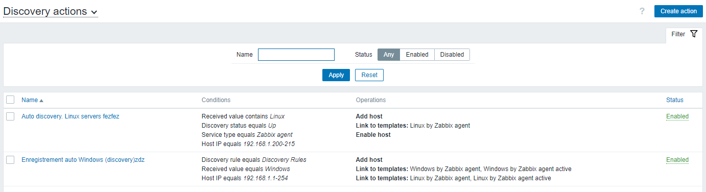


    • Ajoutez des Actions
    • Si actions remplies ajouter des opérations comme ajouter l’host … 

Comme ceci : 

Opérations :
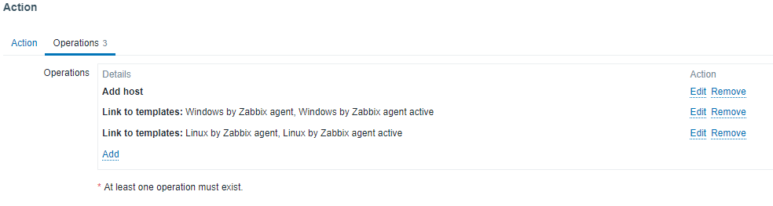
Actions :
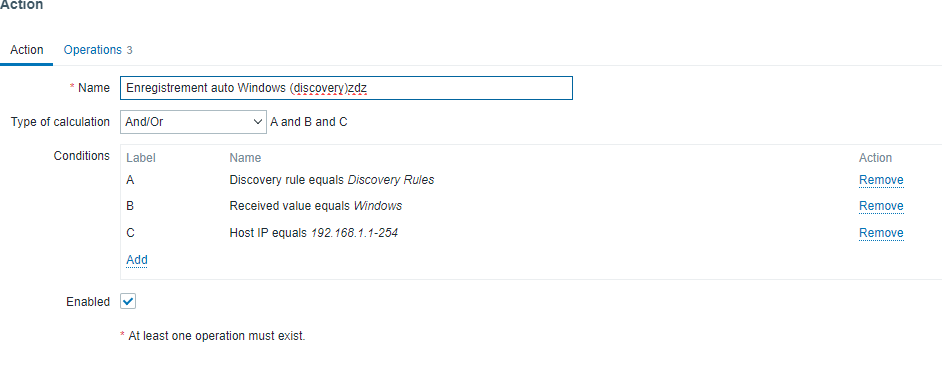

6. Une fois tout ça mis en place veuillez installer l’agent zabbix sur toutes les machines que vous voulez monitorer comme à l’étape [“A. Enregistrement d’un hôte Zabbix et application d’un template adapté pour la collecte d’informations”](#enregistrement-dun-hôte-zabbix-et-application-dun-template-adapté-pour-la-collecte-dinformations)

Puis attendez que les règles/action de découverte s’applique puis rendez-vous dans Monitoring puis Discovery et voici le résultat : 

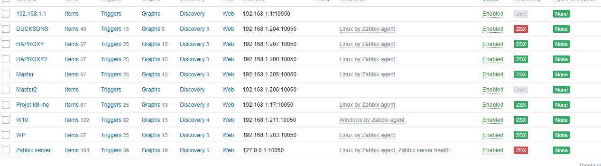

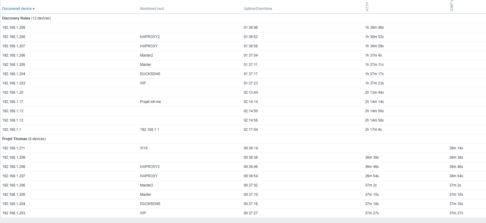

## 2.c Collecte d’information via Agent

Host manuel : 


Collecte de données après le host discovery :

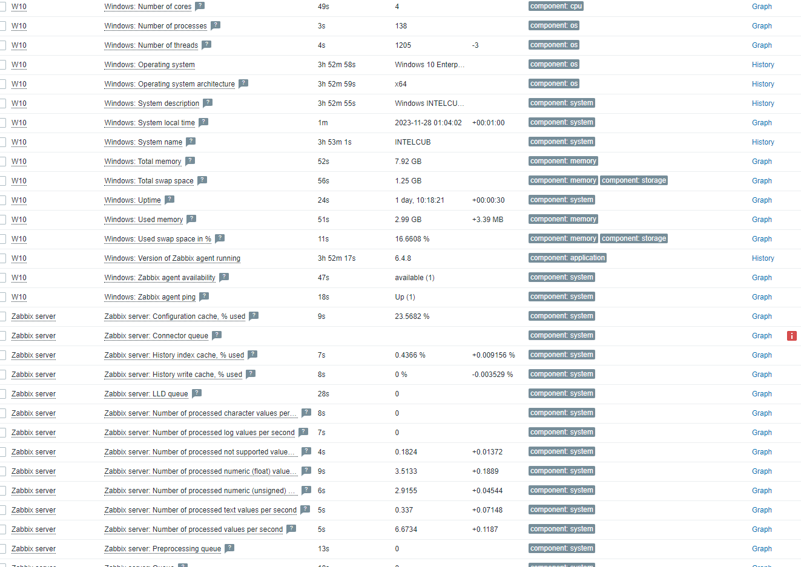

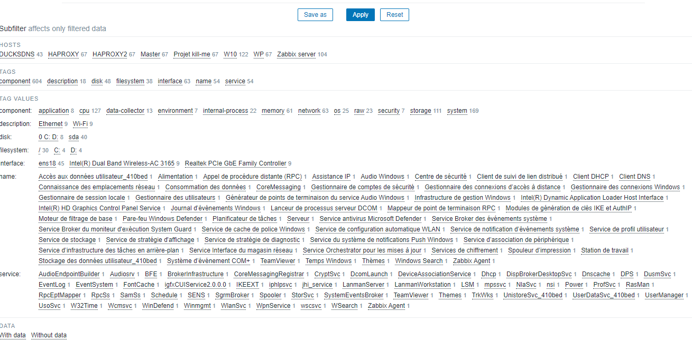

## 2.d Réalisation d’un tableaux de bord

1. Vous allez vous rendre dans “Dashboard” puis “create dashboard”

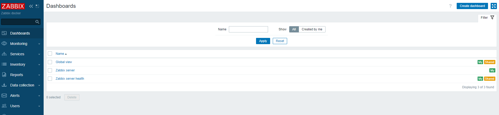

2. Ensuite, cliquez sur l’écran pour ajouter un widget ou vous voulez, puis sélectionnez le type de widget que voulez mettre en place je prendrai en exemple un graph  :

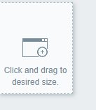

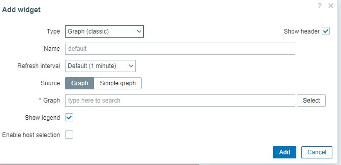


3. Ensuite ajouter un dataset nommez le comme vous voulez, puis sélectionnez les machines que vous souhaitez monitorer dans ce dataset.

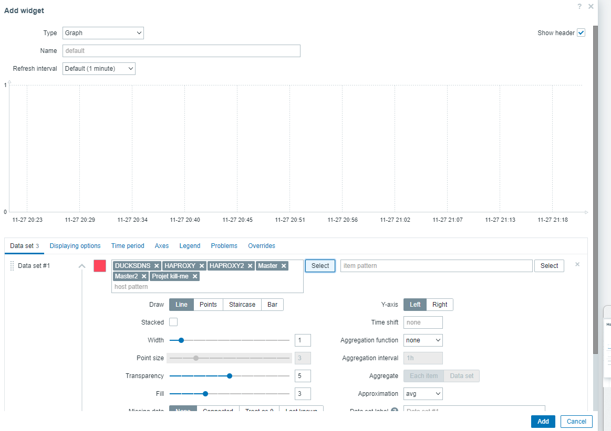


4. Ensuite sélectionner les items que vous souhaitez monitorer en cliquant sur select “item pattern”. Des items comme la ram, le processeur… 

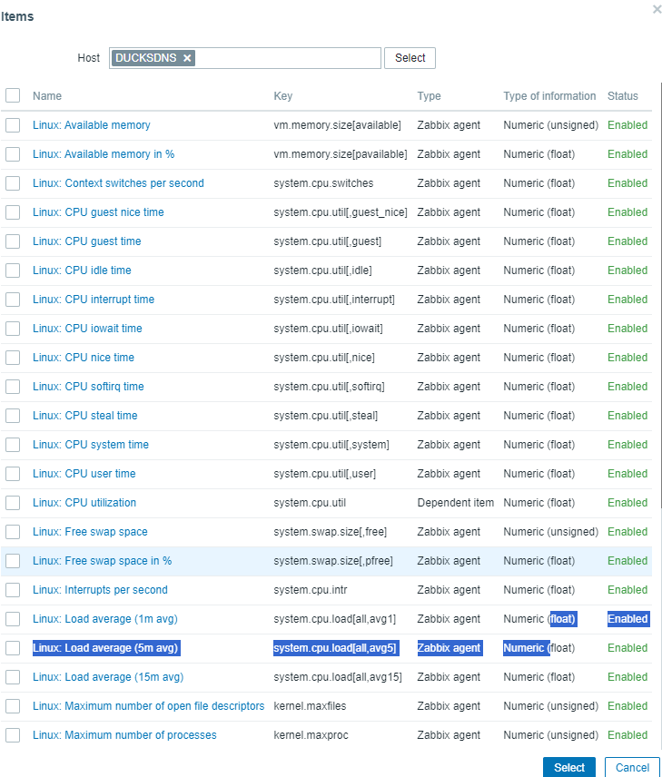


5. Et donc vous pouvez ensuite créer plusieurs types de graph en fonction de ce que vous souhaitez mettre en place graphiquement 

Voici un exemple : 

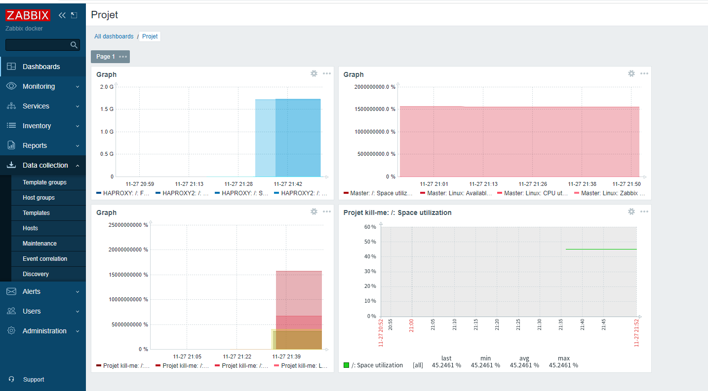

## 2.e Triggers Actions

Un "trigger" dans Zabbix est une condition de surveillance déclenchant une alerte. Une "trigger action" est une séquence d'instructions définie pour réagir à une alerte spécifique, telle que l'envoi de notifications par e-mail. En résumé, les "trigger actions" automatisent les réponses aux événements détectés par les déclencheurs.


    1. Rendez-vous dans Alert, Actions, Triggers actions puis cliquer sur create actions

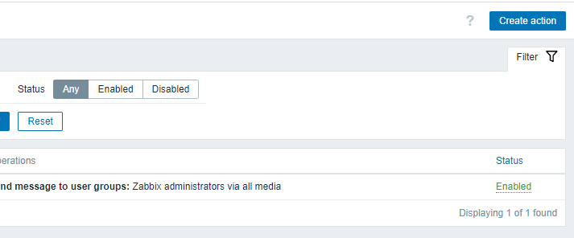

    
    2. Ensuite comme pour les règles discovery on ajoute des conditions/opérations 


    • Ajoutez des conditions
    • Si conditions remplies ajouter des opération comme envoyer une alerte par mail …

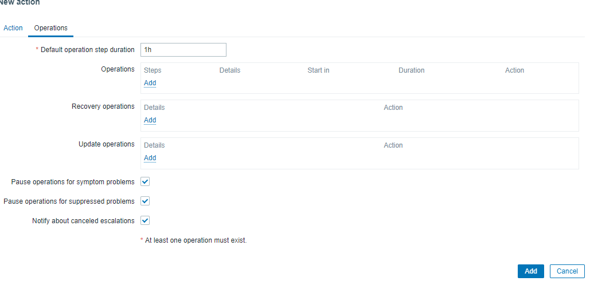

Une fois cela fait vous devriez avoir un résultat à peu près comme ceci (évidemment tout dépend de ce que vous avez définis comme conditions actions) : 

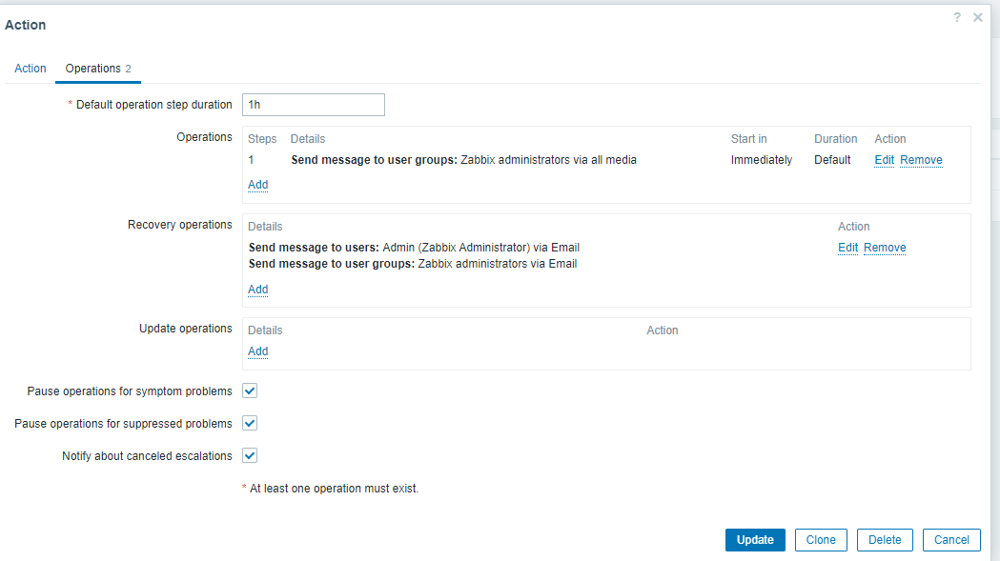